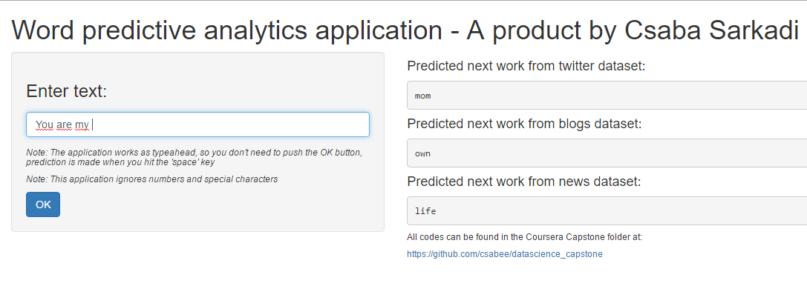

Data Science Capstone Project - Final project submission
========================================================
author: Csaba Sarkadi
date: 2016 10. 02.
autosize: true
transition: rotate

Executive summary
========================================================

This Data Science capstone project is offered by John Hopkins University @ Coursera, in partnership with SwiftKey.
SwiftKey is one of the best predictive keyboar applications for mobile devices, that uses predictive analytics. 

This presentation is part of the Capstone project, with the objective of building a text predictive application the form of a web application.

The main objectives:
* Analyze large textual data sets
* Build a predictive algorithm for words when typing
* Create a predictive web application as the final product
* Write a short presentation describing the algorithm and the application

Algorithm
========================================================

Dataset: as provided, the blogs, the news and the twitter source dataset.

Data processing: the used dataset is provided as pre-processed, lowercased, trimmed.

N-grams: 2,3,4 grams are created to provide the prediction

Prediction: using at least 2 words from a text input as a reference for the n-gram tables.
The application will return with the most frequent next word.

Usage
========================================================

After the application is launched, enter some text in the input box. 
The application will update automatically, when you hit the 'space' button.

The prediction for the 3 datasets can be seen in the application output.

Additional
========================================================

This application is using [reactive expressions](http://shiny.rstudio.com/tutorial/lesson6/) for better user experience, and auto update.

The application can be found @ [ShinyApps.io](https://csabee.shinyapps.io/Data_Science_Capstone_Final/).

This presentation is hosted by [RPubs](https://rpubs.com)

Source can be found @ [GitHub](https://github.com/csabee/datascience_capstone)
